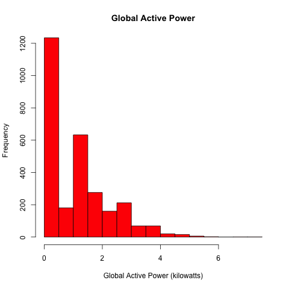
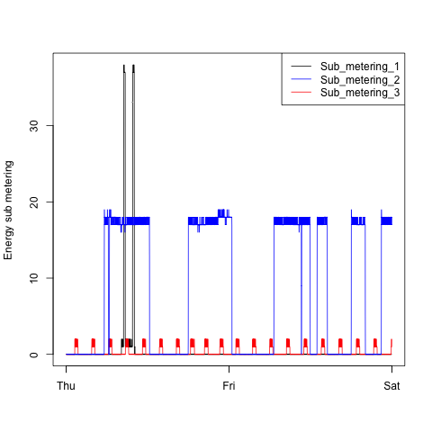
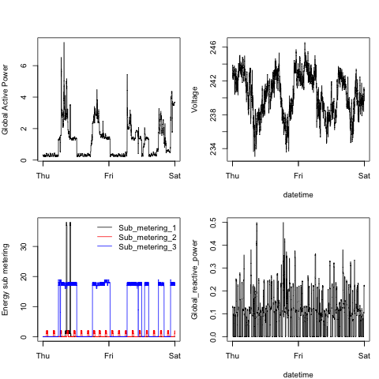

# Instructions for Coursera

Course Title:| Exploratory Data Analysis     | 
------------ | ----------------------------- | 
*Project 1*  | Electric Power Consumption    | 
*Name:*      | Sherri Verdugo                |
*Date:*      | August 9, 2014                |

## Overview

This is the **first** project for the Coursera Exploratory Data Analysis online free class. This file is an addendum to the project so that you may perform the peer assessment in an easier fashion. I hope you enjoy the peer assessments as much as I do. Thank you for taking the time to look at my little projects. 

P.S. I have tried to include all pertinent information so that you can replicate this project...should you want to do that. I highly recommend the Coursera courses :)

### Forked from: <https://github.com/rdpeng/ExData_Plotting1>

### O.S. 

1. Mac OS X Version 10.9.4
2. Processor: 1.7 GHz Intel Core i5
3. Memory: 4 GB 

### RStudio
This project was done entirely using R Studio and the base package from R. 

1. R version 3.1.0 (2014-04-10) -- "Spring Dance"
Copyright (C) 2014 The R Foundation for Statistical Computing
Platform: x86_64-apple-darwin13.1.0 (64-bit)
2. RStudio version: 0.98.953 – © 2009-2013 RStudio, Inc.

### Data Set
The following link was used to download the data set.

<https://d396qusza40orc.cloudfront.net/exdata%2Fdata%2Fhousehold_power_consumption.zip>

### Items on Github

#### Location of Github: 
<https://github.com/verdu103/ExData_Plotting1>

#### Order of Items
**Plot 1** 

1. plot1.R contains the code to generate plot one
2. plot1.png contains the image file for the plot generated in the code.

**Plot 2** 

1. plot2.R contains the code to generate plot two
2. plot2.png contains the image file for the plot generated in the code.

**Plot 3** 

1. plot3.R contains the code to generate plot three
2. plot3.png contains the image file for the plot generated in the code.

**Plot 4** 

1. plot4.R contains the code to generate plot four
2. plot4.png contains the image file for the plot generated in the code.

### Conclusions
This project was a fun and interesting experience. Always remember to set your working directory and use View(datafilename) to recall the variable names for efficient processing.

Thank you and have a most excellent day!
